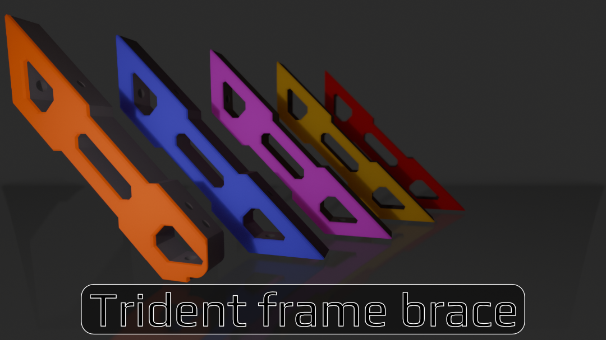
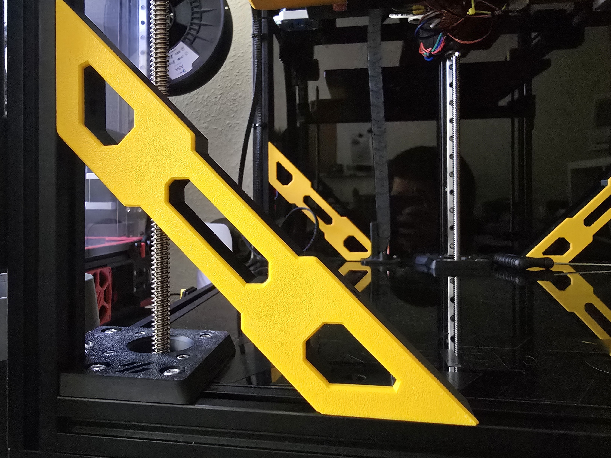

# Trident frame braces with swappable cover
Frame braces for 300 Voron Trident

# Why a brace?
I loved to look of frame braces. So made my own version swappable covers. Safe some filament after changing your accent color.
Braces printed out of proper material (ABS/ASA/...). Cover could be printed in some fancy material like luminous PLA. 
Would PLA melt away. Propably. But maybe it looks cool.

# What you need

## Printed Parts
  - brace_normal_x3.stl
  - brace_z-chain_x1.stl
  - [a]_brace_cover_normal_x3
  - [a]_brace_cover_z-chain_x1

## BOM
  - 8x M3 T-Nuts or hammerhead nuts
  - 8x M3 heatset inserts (Voron Spec M3x5x4)
  - 8x M3x8 for mounting the brace to the frame
  - 8x M3x8 for mounting the cover to the brace. Optionaly cou can put M3x12 for mounting. There is somee extra space left. 

## Print settings
Print parts in Voron print settings. Parts need no support and are oriented correctly.

# Mounting
  - insert the heatset inserts with your favorite tool.
  - mount the cover to the brace with M3x8 screws.
  - mount the braces to the frame. Printed part *brace_z-chain_x1.stl* is mounted at the back left corner. Loose your Z_chain mount for a snug mounting. There is a cutout for screw.
    The othere 3 braces (*brace_normal_x3.stl*) belong to the other corners.
    
    ***Attention please!***
    
    **Caution! The front braces need to be mounted flush to the extrusion at the front!**
    **The braces have a gap of 0.5mm to the Z Carriage. Check clearence after mounting!**
    
  - Enjoy.

# Issues / ToDo / Ideas

## Issues
no known yet

## ToDo
  - check for other Trident sizes

## Ideas
  - some more cover variants (trident, Voron logo, serial,...)

You like my little project? Would be nice if you visit my printables site and leave some likes (just want a free spool ;) )
https://www.printables.com/model/1257855-voron-trident-frame-brace-with-cover
